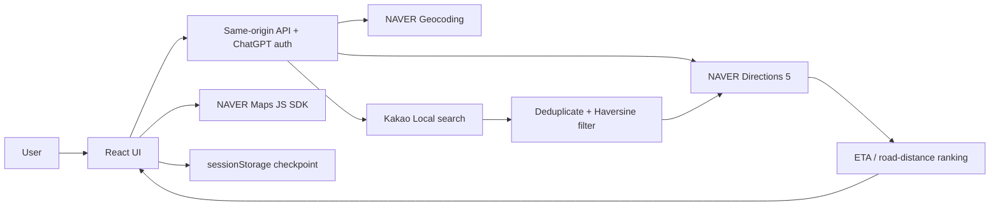

# Architecture

## System Overview

`가까운 한 끼`는 React/Vinext UI와 Cloudflare Worker API가 한 저장소에서 빌드되는 개인용 지도 탐색 애플리케이션이다. 서버 API가 Kakao Local과 NAVER Maps를 조합하고, 브라우저는 후보 비교와 지도 표시를 담당한다. 운영 DB, background worker, scheduler, bot, LLM 호출은 없다.

## Application Entry Points

- `app/page.tsx`: 주변 탐색과 legacy 비교 탭을 여는 root page
- `app/layout.tsx`: 한국어 document metadata와 global styles
- `app/api/status/route.ts`: auth 및 provider 설정 상태, 공개 map Client ID
- `app/api/geocode/route.ts`: 주소 지오코딩
- `app/api/places/route.ts`: 주변 후보 검색
- `app/api/nearby-routes/route.ts`: 최대 4개 후보의 경로 계산
- `app/api/compare/route.ts`: legacy 저장 매장/직접 목적지 비교
- `dist/server/index.js`: `npm run build`가 생성하는 Cloudflare Worker entry point

## Major Components

### Frontend

- `NearbyExplorer`: 입력, GPS 요청, progress, abort/resume, 정렬, CSV, WebMCP 주변 도구 등록
- `NearbyMap`: NAVER Maps SDK를 불러와 출발지·후보 marker와 선택 경로를 rendering
- `LegacyRoutes`: 정적 매장 목록 또는 직접 목적지의 기존 비교 흐름
- `components/ui`: 프로젝트에 포함된 UI primitives. framework 교체 없이 재사용한다.

### API and Security Boundary

`lib/api.ts`의 `authorize()`가 Sites/ChatGPT 사용자 header가 있는지 확인하고 cross-site fetch를 거부한다. 각 POST API는 content type과 10 KB body limit를 확인하고 Zod schema로 payload를 검증한다. 응답은 `no-store`와 `nosniff` header를 사용한다.

화면 자체는 client page이며, provider 상태와 모든 데이터 API가 인증 경계를 적용한다. 인증 실패는 UI에서 ChatGPT sign-in 경로로 안내하되 서버 검사를 우회하지 않는다.

### Provider Services

- `services/maps/geocoding.ts`: normalized address와 5분 TTL cache를 NAVER client 앞에 두고, 주소 실패 시 Kakao 장소 후보를 단일 확정 또는 복수 선택 응답으로 반환한다.
- `services/maps/placeSearch.ts`: Kakao category/keyword endpoint, 최대 3페이지, 10초 timeout, manual redirect, 반경 확대와 warning 처리를 담당한다. 주차 조건일 때 PK6를 검색 영역당 한 번 조회하고 후보별 500m 최근접 주차장을 local calculation으로 연결한다.
- `services/maps/routing.ts`: NAVER `trafast` 단일 목적지 자동차 경로와 45초 TTL cache를 제공한다.
- `services/maps/routeMatrix.ts`: provider capability를 추상화하되 현재는 matrix가 아닌 최대 4개 worker의 단건 호출이다.
- `services/maps/ranking.ts`: Haversine 필터, deduplication, ETA/도로거리/추천 정렬 정책을 담당한다.
- `lib/naver.ts`: Geocoding/Directions 5 HTTP client, 18초 timeout, redirect 차단, provider 오류 mapping을 담당한다.

## Nearby Data Flow

1. 사용자가 주소·장소명 또는 browser geolocation 좌표, query, radius, count를 입력한다.
2. 직접 입력은 `/api/geocode`가 NAVER Geocoding을 먼저 사용한다. 주소 결과가 없고 Kakao 장소가 하나면 `Point`, 여러 개면 선택 후보를 반환하며 브라우저는 사용자가 고른 좌표로 계속한다.
3. 검색어에서 POI와 지원 조건을 분리한다. 주차 조건은 인식하되 provider가 값을 주지 않으면 `unknown`으로 유지한다.
4. `/api/places`가 Kakao Local을 호출한다. keyword는 관련도와 직선거리를 함께 고려하고 category는 거리순을 사용한다. 20 km 초과는 구면 원을 포함하는 rectangle을 보내고 Haversine으로 원 밖 결과를 제거한다.
5. 주차 조건이면 후보 영역의 Kakao PK6를 한 번 조회해 각 후보 500m 안의 최근접 주차장을 연결한다. `storeParking`은 계속 `unknown`이며 `nearbyParking`과 합치지 않는다.
6. id 및 이름/좌표 identity로 중복을 제거하고 후보를 최대 30개 유지한다.
7. client가 후보를 4개씩 `/api/nearby-routes`에 보낸다. 서버도 최대 4개 worker로 NAVER Directions 5를 호출한다.
8. 개별 경로 실패는 해당 후보의 `routeError`로 반환한다. fatal auth/quota 오류는 이후 후보를 중단하되 이미 성공한 결과는 보존한다.
9. 성공 후보를 교통 ETA, 도로거리, 검색 관련도 또는 `0.8 * normalized ETA + 0.2 * normalized distance`로 정렬한다.
10. 결과를 목록·지도·CSV로 표시한다. 모든 후보 marker와 선택 후보의 경로선만 표시하며 정렬 변경은 API를 다시 호출하지 않는다.

## Legacy Data Flow

`LegacyRoutes`는 `lib/stores.json`의 매장을 네 곳씩 `/api/compare`에 보내거나, 직접 입력한 목적지를 NAVER Geocoding한 뒤 `traoptimal` 경로 한 건을 조회한다. 주변 탐색과 분리되어 기존 interface와 동작을 보존한다.

## Data and Storage

- 영속 DB와 object storage는 없다. D1/R2 binding은 `null`이다.
- `db/`와 `examples/d1/`은 Sites starter의 opt-in scaffold이며 운영 data flow에 참여하지 않는다.
- `lib/stores.json`은 version-controlled legacy static data다.
- `TtlCache`는 각 Worker isolate 메모리의 bounded LRU-like TTL map이다. 재시작·다른 isolate 사이에 공유되지 않는다.
- resume checkpoint는 browser sessionStorage에 최대 30분 보관하며 route geometry는 저장하지 않는다.

## External APIs

| Service | Purpose | Credential exposure | Failure policy |
|---|---|---|---|
| Kakao Local REST | 장소 후보 검색 | REST key는 server-only | 10초 timeout, auth/quota fatal, 확대 중 실패 시 기존 후보 사용 가능 |
| NAVER Geocoding | 주소→좌표 | ID/Secret server-only | 18초 timeout, redirect 차단 |
| NAVER Directions 5 | 자동차 ETA·거리·path | ID/Secret server-only | 후보별 부분 실패, auth/quota fatal |
| NAVER Maps JS SDK | 지도 rendering | 공개 Client ID만 browser 전달 | 실패 시 목록 비교 유지 |
| Sites/ChatGPT auth | 개인 접근 식별 | trusted request headers | 없으면 API 401 |

재시도 로직은 현재 없다. 사용자가 명시적으로 재실행하거나 중단 checkpoint를 재개한다.

## WebMCP and AI Boundary

`lib/nearby-webmcp.ts`와 `lib/webmcp.ts`는 지원 브라우저의 `document.modelContext.registerTool`에 imperative 도구를 등록한다. 도구는 일반 UI와 같은 client/API flow를 실행한다. 애플리케이션 서버는 OpenAI/Anthropic 등 LLM을 호출하지 않으며 AI가 route 숫자나 장소 속성을 생성하지 않는다.

## Error Handling

- `MapsError`가 사용자용 message, HTTP status, fatal 여부를 전달한다.
- Zod 오류는 400, 잘못된 content type은 415, 큰 body는 413이다.
- provider redirect는 credential 유출 방지를 위해 따라가지 않는다.
- UI abort는 진행 중 fetch를 취소하고 완료된 후보만 임시 결과로 남긴다.
- 일부 후보 실패는 전체 성공 결과를 삭제하지 않는다.

## Deployment

- `vinext build`가 React/Vinext app과 Worker output을 `dist/`에 만든다.
- `build/sites-vite-plugin.ts`가 Sites manifest와 Worker packaging을 연결한다.
- `.openai/hosting.json`은 기존 Sites `project_id`를 보존하며 D1/R2를 선언하지 않는다.
- 배포 runtime은 Cloudflare Workers이며 기존 사이트는 owner-only/private 접근을 유지해야 한다.
- Dockerfile, GitHub Actions 등 별도 Docker/CI/CD pipeline은 없다.

## Architectural Constraints

- Directions 5의 multi-goal은 1×N matrix가 아니므로 행렬처럼 사용하지 않는다.
- route concurrency를 무제한으로 늘리지 않고 현재 API/UI의 4개 제한을 함께 유지한다.
- 후보 검색의 직선거리와 최종 자동차 도로거리 의미를 분리한다.
- traffic timestamp와 source를 결과에 유지하며 cache된 값을 실시간 새 호출처럼 설명하지 않는다.
- 매장 자체 주차와 주변 주차장 존재를 분리하고 provider가 주지 않은 주차 가능 여부를 추정하지 않는다.
- provider가 주지 않은 rating/review/open status를 채우지 않는다.
- secret은 server-only이고 public Client ID 외에는 client response/log/storage로 내보내지 않는다.
- auth나 owner-only deployment 범위를 기능 편의 때문에 완화하지 않는다.

## Technical Debt

- ESLint가 green이 아니며 effect 상태 초기화와 map SDK typing을 정리해야 한다.
- map SDK global에 `any`가 많아 compile-time boundary가 약하다.
- browser E2E와 WebMCP runtime test가 없다.
- provider-wide rate limiting/backoff와 persistent/shared cache가 없다.
- package metadata가 starter 이름을 사용한다.
- 공유 hosted Git remote가 없어 여러 PC 연속 개발이 아직 완성되지 않았다.
